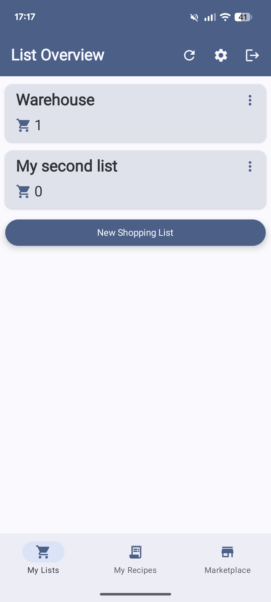
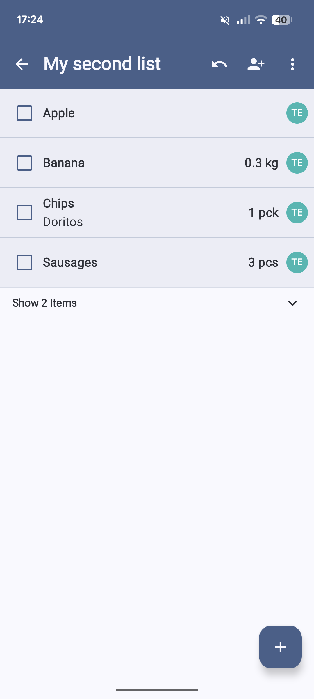
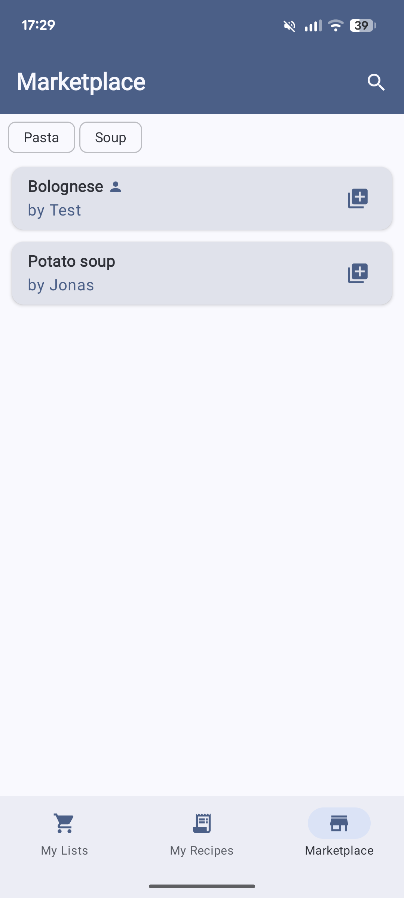

# 🛒 ShopIt

ShopIt is a full-stack shopping management platform for creating, organizing, and syncing shopping lists and recipes across devices.

---

## 📦 Project Structure

```plaintext
.
├── backend/              # Spring Boot backend (REST API, authentication, persistence)
├── frontend-android/     # Android app (Kotlin, Jetpack Compose)
└── frontend-web/         # Web app (Angular)
```

---

## 🛠️ Tech Stack

**Backend**
- Java 21 (Spring Boot)
- MongoDB (NoSQL, document-based)
- JWT Authentication
- Hosted on Oracle Cloud

**Android Frontend**
- Kotlin
- Jetpack Compose (Material 3, Dark Mode)
- Hilt, Retrofit, MVVM

**Web Frontend**
- Angular
- TypeScript, SCSS
- Modular architecture

---

## 🚀 Features

- Secure user authentication (JWT)
- Shopping list & item management
- Recipe storage and organization
- Cross-platform sync (Android + Web)
- Cloud-hosted backend (Oracle Cloud)

---

## 📸 Screenshots (Android)

<div align="center">
  
  
  
  
</div>

---

## 👤 Author

Developed by [joengelke](https://github.com/joengelke)

---
